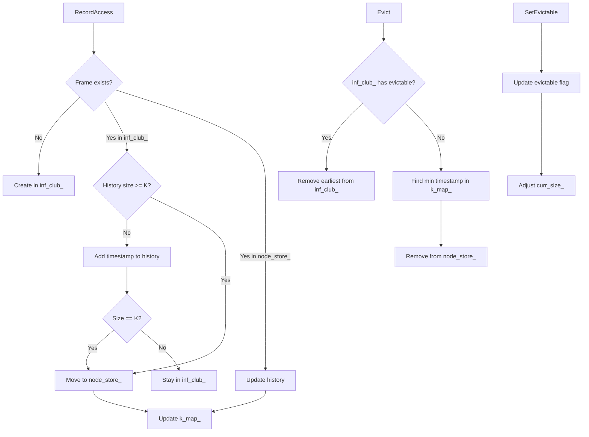

# LRU-K Page Replacement: A Thread-Safe Implementation

## 1. Motivation

Traditional LRU replacement fails in correlated reference streams where recent access doesn't predict future reuse. Consider sequential scans that pollute the cache or temporal localities with different frequencies. LRU-K addresses this by tracking the **backward K-distance**: the time difference between now and the K-th most recent access.

**Backward K-distance**: For frame `f` at time `t`, if `t₁, t₂, ..., tₙ` are access timestamps (most recent first), then:
- `Dₖ(f,t) = t - tₖ` if `n ≥ K`  
- `Dₖ(f,t) = ∞` if `n < K`

The key insight: frames with `∞` distance (insufficient history) are evicted first using LRU among themselves. Otherwise, evict the frame with maximum `Dₖ`.

## 2. Design Overview

**Core Data Structures:**
- `node_store_`: Hash map `frame_id → LRUKNode` for frames with ≥K accesses
- `inf_club_`: List of `LRUKNode` for frames with <K accesses  
- `k_map_`: Map `timestamp → frame_id` for O(1) victim selection
- `LRUKNode`: Per-frame access history (bounded list of timestamps)

**API Surface:**
```cpp
bool Evict(frame_id_t* frame_id);              // Select & remove victim
void RecordAccess(frame_id_t fid);             // Log access at current timestamp  
void SetEvictable(frame_id_t fid, bool flag);  // Control eviction eligibility
void Remove(frame_id_t fid);                   // Force remove specific frame
size_t Size();                                 // Count evictable frames
```

**Invariants:**
- Only evictable frames contribute to `Size()`
- Frames transition from `inf_club_` to `node_store_` upon K-th access
- `k_map_` maintains K-th timestamp for efficient victim selection
- Thread-safety via `std::mutex latch_`

## 3. Architecture Diagram



## 4. Core Algorithm

### Recording Access
```cpp
void RecordAccess(frame_id_t fid) {
    lock(latch_);
    
    if (fid in node_store_) {
        node = node_store_[fid];
        node.history.push_back(current_timestamp_);
        if (node.history.size() > K) {
            k_map_.erase(node.history.front());
            node.history.pop_front();
        }
        k_map_[node.history.front()] = fid;
    } else if (fid in inf_club_) {
        node = find(inf_club_, fid);
        node.history.push_back(current_timestamp_);
        if (node.history.size() == K) {
            k_map_[node.history.front()] = fid;
            move(node, inf_club_ → node_store_);
        }
    } else {
        new_node.fid = fid;
        new_node.history = [current_timestamp_];
        inf_club_.push_back(new_node);
    }
    
    current_timestamp_++;
}
```

**Complexity**: O(1) average, O(n) worst-case for `inf_club_` search

### Victim Selection
```cpp
bool Evict(frame_id_t* victim) {
    lock(latch_);
    
    // Priority 1: Evictable frames in inf_club_ (∞ distance)
    for (node in inf_club_) {
        if (node.is_evictable_) {
            *victim = node.fid;
            inf_club_.erase(node);
            curr_size_--;
            return true;
        }
    }
    
    // Priority 2: Frame with min K-th timestamp (max Dₖ)
    for (auto [timestamp, fid] : k_map_) {
        node = node_store_[fid];
        if (node.is_evictable_) {
            *victim = fid;
            node_store_.erase(fid);
            k_map_.erase(timestamp);
            curr_size_--;
            return true;
        }
    }
    
    return false; // No evictable frames
}
```

**Complexity**: O(|inf_club_|) + O(|k_map_|) = O(n) worst-case

## 5. Edge Cases & Correctness

**Frames with <K accesses**: Stored in `inf_club_` with `∞` backward distance. Evicted using insertion order (LRU among `∞` frames).

**Pin transitions**: `SetEvictable(fid, false)` decrements `curr_size_`; `SetEvictable(fid, true)` increments it. No effect on access history.

**Duplicate accesses**: Each `RecordAccess()` increments `current_timestamp_`, ensuring strict ordering even for identical frames.

**Empty candidate set**: `Evict()` returns `false` when `curr_size_ == 0` or no evictable frames exist.

**Invalid removals**: `Remove()` on non-evictable frames throws exception. Missing frames are silently ignored per specification.

**K=1 degradation**: With `K=1`, all frames immediately enter `node_store_` with `Dₖ = t - t₁ = 0`. Selection becomes pure recency-based (LRU).

## 6. Optimizations

**Lazy priority updates**: `k_map_` stores only the K-th timestamp rather than recomputing `Dₖ` values. Victim selection iterates in timestamp order (equivalent to `Dₖ` order).

**O(1) membership**: Hash map `node_store_` provides constant-time frame lookup. `inf_club_` requires linear search but typically contains few items.

**Bounded history**: Each frame's history is capped at K timestamps, providing O(K) space per frame regardless of access frequency.

**Thread-safe operations**: Single mutex `latch_` protects all data structures. `std::scoped_lock` ensures exception safety.

## 7. Worked Example

**Setup**: K=2, frames A,B,C, initial empty state

| Time | Access | A History | B History | C History | inf_club_ | k_map_ | Action |
|------|--------|-----------|-----------|-----------|-----------|---------|---------|
| 1    | A      | [1]       | []        | []        | [A]       | {}      | Create A |
| 2    | B      | [1]       | [2]       | []        | [A,B]     | {}      | Create B |
| 3    | A      | [1,3]     | [2]       | []        | [B]       | {1:A}   | A→store |
| 4    | C      | [1,3]     | [2]       | [4]       | [B,C]     | {1:A}   | Create C |
| 5    | B      | [1,3]     | [2,5]     | [4]       | [C]       | {1:A,2:B} | B→store |

**Eviction at time 5**: 
- `inf_club_` contains C (∞ distance)
- `k_map_` contains A(D₂=4), B(D₂=3)  
- **Victim**: C (∞ distance wins over finite)

## 8. Comparison & Trade-offs

| Algorithm | Strengths | Weaknesses | Best Use Case |
|-----------|-----------|------------|---------------|
| LRU | Simple, O(1) ops | Scan vulnerability | Random access patterns |
| LRU-K | Scan resistant, temporal | Complex, O(n) evict | Mixed scan/random workloads |
| 2Q | Balanced complexity | Fixed queue ratios | Web caching |
| ARC | Self-tuning | Patent restrictions | Adaptive workloads |

**Tuning K**: Higher K provides better history but increases memory overhead. K=2 often optimal for database workloads; K=3+ shows diminishing returns.

## 9. Mapping to Implementation

**Core structures** ([lru_k_replacer.h:195-202](https://15445.courses.cs.cmu.edu/spring2023/project1/)):
- `node_store_`: Line 195 - Primary frame storage
- `inf_club_`: Line 196 - Infinite distance candidates  
- `k_map_`: Line 197 - Timestamp→frame mapping

**Key operations** ([lru_k_replacer.cpp](https://15445.courses.cs.cmu.edu/spring2023/project1/)):
- `Evict()`: Lines 20-56 - Two-tier victim selection
- `RecordAccess()`: Lines 58-108 - History management & transitions
- `SetEvictable()`: Lines 115-132 - Pin state control

**Thread safety**: `std::scoped_lock` (Lines 21, 154) and `std::unique_lock` (Lines 59, 116) protect shared state.

---

## Tuning & Practical Tips

- ✅ **Set K=2 for most database workloads** (sweet spot for scan resistance vs. complexity)
- ✅ **Monitor `inf_club_` size** - high values suggest insufficient K or memory pressure  
- ✅ **Profile eviction latency** - O(n) worst-case may require async victim pre-selection
- ✅ **Consider access type hints** - weight sequential scans differently than random gets
- ✅ **Batch timestamp updates** - increment once per transaction rather than per page access
- ✅ **Implement emergency LRU fallback** - when history maintenance becomes too expensive