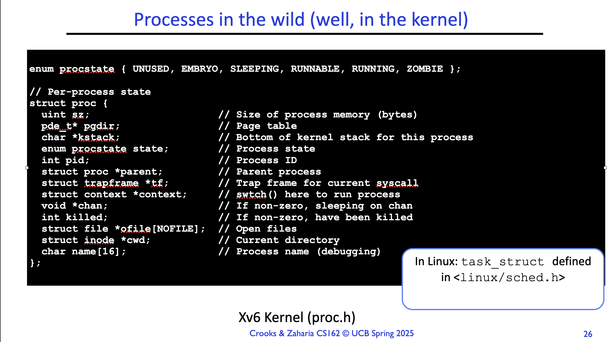

Understanding process and thread

Understanding thread
In Wikipedia, a thread is defined as
"a thread of execution is the smallest sequence of programmed instructions that can be managed independently by a scheduler, 
which is typically a part of the operating system. In many cases, a thread is a component of a process."

Clearly, this explanation is from the point of view of the operating system. If we view it from hardware perspective, a thread is 
nothing more than a single, linear stream of instruction in flight on CPU, plus just enough private state to keep that streaming going.


```c
struct thread
{
    /* Owned by thread.c. */
    tid_t tid;                          /**< Thread identifier. */
    enum thread_status status;          /**< Thread state. */
    char name[16];                      /**< Name (for debugging purposes). */
    uint8_t *stack;                     /**< Saved stack pointer. */
    int priority;                       /**< Priority. */
    struct list_elem allelem;           /**< List element for all threads list. */

    /* Shared between thread.c and synch.c. */
    struct list_elem elem;              /**< List element. */

#ifdef USERPROG
    /* Owned by userprog/process.c. */
    uint32_t *pagedir;                  /**< Page directory. */
#endif

    /* Owned by thread.c. */
    unsigned magic;                     /**< Detects stack overflow. */
};
```


the struct of process in xv6

